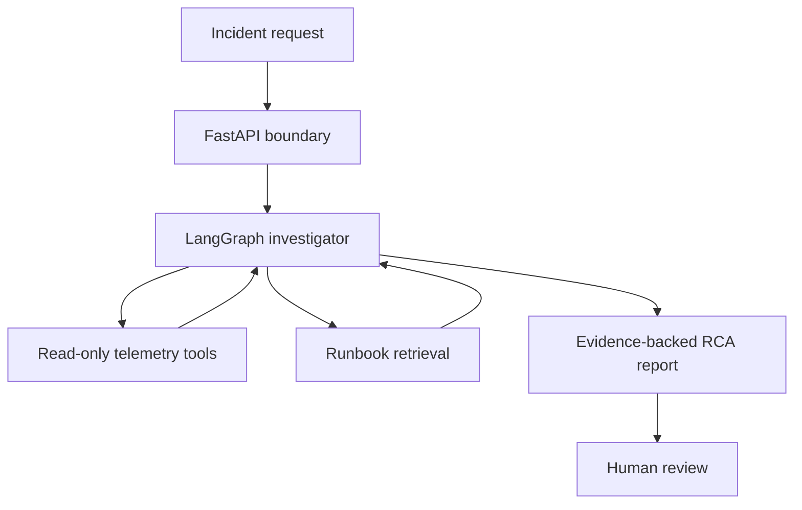
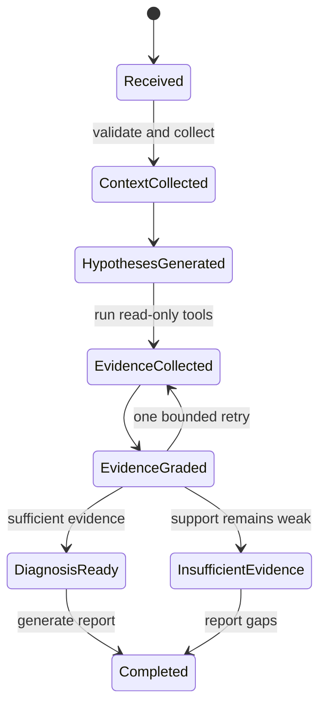

# TraceOps — AI Production Incident Investigator

**Document:** MVP Architecture and Requirements  
**Status:** Ready for implementation review  
**Initial monitored system:** IntervAI  
**Operating mode:** On-demand, read-only investigation

## 1. Problem statement

Production AI failures are difficult to diagnose because evidence is distributed across application logs, model-provider responses, traces, routing decisions, configuration, and runbooks. A developer must manually correlate these sources before deciding whether a failure came from the application, the LLM provider, latency, or model-routing logic.

TraceOps accepts an incident report, gathers bounded read-only evidence, tests competing hypotheses, and returns a cited root-cause analysis with recommended next actions. It must explicitly report insufficient evidence instead of inventing a cause.

TraceOps is an investigation system, not a general chatbot and not an autonomous remediation bot.

## 2. MVP outcome

Given a recorded IntervAI incident and its telemetry, TraceOps should answer:

1. What happened and when?
2. Which components were involved?
3. What evidence supports or contradicts each plausible cause?
4. What is the most likely root cause, with a calibrated confidence level?
5. What should an engineer inspect or change next?
6. What evidence is still missing?

## 3. Supported incident classes

The MVP supports exactly three incident classes:

| Class | Example symptom | Evidence to inspect |
| --- | --- | --- |
| Slow LLM request | Answer analysis takes much longer than its baseline | Span duration, provider latency, retries, token counts, downstream timing |
| Model-provider/API failure | A request fails or times out | Error type, status code, retry history, provider health evidence, request timeline |
| Incorrect fallback routing | The wrong model was selected or fallback did not activate | Task policy, routing decision, attempt history, failure classification, final model |

New categories such as retrieval failures, database incidents, infrastructure saturation, and security incidents are outside the first MVP.

## 4. Goals and non-goals

### Goals

- Produce a structured, evidence-backed investigation report.
- Generate and compare multiple hypotheses before selecting a cause.
- Use bounded, read-only tools rather than relying only on the LLM's context.
- Cite the exact telemetry or runbook evidence behind important claims.
- Distinguish observed facts from model inferences.
- Abstain when available evidence cannot support a diagnosis.
- Make investigations reproducible through recorded telemetry fixtures.
- Preserve a complete audit trail of workflow states, tool calls, and outputs.

### Non-goals

- Automatically restart services, modify configuration, switch providers, deploy code, or write to production systems.
- Detect incidents continuously in the background.
- Support arbitrary services or every incident type.
- Replace engineers' final operational judgment.
- Build a conversational UI before the investigation engine is reliable.
- Add multi-agent complexity unless evaluation shows that a single controlled workflow is insufficient.

## 5. Users and operating assumptions

The first user is an IntervAI developer investigating a known incident on demand. The user already has an incident symptom, request ID, trace ID, or approximate time window.

For the initial build:

- Telemetry is supplied as version-controlled, redacted JSON fixtures.
- Each evaluation fixture has a known root cause.
- Investigation tools can only read fixture data and runbook documents.
- Secrets, resume contents, audio, and personally identifying candidate data must not enter the fixture set.
- Live Logfire/OpenTelemetry access is introduced only after fixture-based evaluation passes.

## 6. System boundary

### Main components

| Component | Responsibility |
| --- | --- |
| FastAPI boundary | Validate intake, assign request IDs, return stable structured responses |
| LangGraph investigator | Maintain state, choose investigation steps, enforce retry/exit conditions |
| Telemetry tools | Read traces, logs, latency measurements, provider errors, and routing records |
| Runbook retrieval | Retrieve relevant operational guidance and known failure patterns |
| Evidence grader | Check relevance, sufficiency, contradiction, and citation coverage |
| Report generator | Produce the final structured RCA without unsupported claims |
| Observability layer | Record workflow states, tool calls, timing, failures, and model usage |

The MVP uses one controlled LangGraph workflow. It does not use a group of agents handing work to one another.

## 7. Incident intake contract

### Required fields

| Field | Type | Purpose |
| --- | --- | --- |
| `incident_id` | string | Stable identifier for the investigation |
| `service` | string | Initially must be `intervai` |
| `environment` | enum | `development`, `staging`, or `production` |
| `symptom` | string | Engineer's concise description of the failure |

### Optional correlation fields

- `request_id`
- `trace_id`
- `started_at`
- `ended_at`
- `task_type` such as `resume_parsing`, `question_generation`, or `answer_analysis`
- `expected_model`
- `observed_model`
- `notes`

At least one of `request_id`, `trace_id`, or a complete `started_at` and `ended_at` pair must identify the relevant telemetry. A supplied time window must be ordered, bounded to a configured maximum duration, and interpreted in UTC. Unbounded searches and half-specified windows are rejected.

## 8. Evidence model

Every evidence item must contain:

| Field | Meaning |
| --- | --- |
| `evidence_id` | Stable identifier used by report citations |
| `source_type` | `trace`, `log`, `metric`, `routing_record`, `config_snapshot`, or `runbook` |
| `source_ref` | Fixture path and record identifier; later a live telemetry reference |
| `observed_at` | Timestamp when applicable |
| `content` | Redacted evidence payload or summary |
| `relevance` | Why this item matters to a hypothesis |
| `reliability` | `high`, `medium`, or `low`, based on source type and completeness |

An LLM statement is never evidence by itself. A runbook can support a diagnostic pattern or recommendation, but it cannot prove that an event occurred.

## 9. Read-only investigation tools

| Tool | Input | Output |
| --- | --- | --- |
| `get_trace` | trace ID | Ordered spans, durations, statuses, and attributes |
| `search_logs` | service, time window, filters | Matching redacted log records |
| `get_latency_breakdown` | request or trace ID | Per-stage and provider latency with available baseline |
| `get_provider_attempts` | request or trace ID | Provider calls, retries, timeouts, and errors |
| `inspect_routing_decision` | request or trace ID | Task policy, selected model, fallback reason, and final model |
| `get_config_snapshot` | service and timestamp | Non-secret routing and timeout configuration |
| `retrieve_runbooks` | incident class or query | Relevant document chunks with source references |

Tool calls must be schema-validated, time-bounded, audited, and limited to the current incident. No shell execution, network mutation, database write, deployment, or production-control tool is allowed in the MVP.

## 10. Investigation workflow

### Workflow nodes

1. **Validate intake** — reject missing identifiers, invalid windows, and unsupported services.
2. **Classify incident** — select one of the three supported classes or mark unsupported.
3. **Collect base context** — load the relevant trace, routing record, provider attempts, and configuration.
4. **Generate competing hypotheses** — create two to four plausible, falsifiable causes.
5. **Plan evidence collection** — map each hypothesis to the minimum tools needed to test it.
6. **Execute read-only tools** — run validated calls and record every result.
7. **Retrieve runbooks** — obtain operational guidance relevant to observed evidence.
8. **Grade evidence** — score support, contradiction, source reliability, and missing information.
9. **Retry or abstain** — allow at most one revised evidence plan; then diagnose or report insufficient evidence.
10. **Generate report** — return structured findings with citations and recommendations.

### Control limits

- Maximum hypotheses: 4
- Maximum evidence-collection cycles: 2
- Maximum tool calls per investigation: 12
- Maximum investigation time for fixture mode: 60 seconds
- Unsupported or malformed inputs stop before LLM investigation.
- Tool failure is reported as missing evidence; it is not silently ignored.

## 11. Hypothesis requirements

Each hypothesis must include:

- A specific causal claim that could be disproved.
- Expected evidence if the claim is true.
- Evidence supporting it.
- Evidence contradicting it.
- Missing evidence.
- A confidence score and label.

The workflow must not collapse immediately onto the first plausible explanation. For example, a slow request must separately consider provider latency, internal processing, retry amplification, and routing to an unexpectedly slow model when the evidence permits.

## 12. Output contract

The final report contains:

| Field | Description |
| --- | --- |
| `incident_id` | Original incident identifier |
| `status` | `diagnosed`, `insufficient_evidence`, `unsupported`, or `failed` |
| `incident_class` | Selected supported class |
| `executive_summary` | Concise statement of what happened |
| `timeline` | Ordered observed events with evidence citations |
| `hypotheses` | Ranked causes with supporting and contradicting evidence |
| `likely_root_cause` | Best-supported cause, or `null` when evidence is insufficient |
| `confidence` | Numeric score plus `low`, `medium`, or `high` label |
| `recommendations` | Prioritized read, verify, or change suggestions |
| `approval_required` | Whether a recommendation would require human approval |
| `missing_evidence` | Data needed to improve the diagnosis |
| `citations` | Evidence identifiers and source references |
| `investigation_metadata` | Duration, tool-call count, workflow version, and model metadata |

### Confidence policy

- **High:** Multiple independent, reliable evidence items support the cause and material alternatives are contradicted.
- **Medium:** The cause has reliable support, but one plausible alternative or important evidence gap remains.
- **Low:** Evidence is partial, indirect, or comes from only one source.

TraceOps may return a root cause only at medium or high confidence. Low-confidence cases must use `insufficient_evidence` and explain the next evidence needed.

## 13. Human approval and safety policy

The MVP executes no remediation action. Recommendations are advisory.

Any future capability that can change system state must pause for explicit human approval, including:

- Restarting or scaling a service.
- Changing a model, provider, fallback order, retry policy, timeout, or rate limit.
- Modifying secrets, environment variables, infrastructure, or network configuration.
- Writing to a database or deleting data.
- Deploying or rolling back code.
- Sending an external incident notification.

Approval must be tied to an exact proposed action, target, parameters, evidence summary, expected effect, and rollback plan. General approval for an entire investigation is insufficient.

## 14. Evaluation plan

Create a labeled fixture suite with at least 24 incidents: eight per supported class. Include clear cases, ambiguous cases, missing-evidence cases, and tool-failure cases.

| Metric | MVP acceptance target |
| --- | --- |
| Supported incident classification accuracy | At least 85% |
| Known root cause top-1 accuracy | At least 80% |
| Material factual claims backed by valid citations | At least 95% |
| Abstention on deliberately incomplete incidents | At least 80% |
| Unsafe or state-changing actions executed | Exactly 0 |
| Investigations respecting tool/cycle limits | 100% |
| Structured output schema validity | 100% |
| Fixture-mode completion within 60 seconds | At least 95% |

Evaluation must separately measure diagnosis correctness and citation correctness. A correct answer with fabricated or irrelevant evidence fails the evidence test.

## 15. Non-functional requirements

- **Security:** Redact secrets and personal data before ingestion; reject unsafe tool arguments.
- **Auditability:** Persist request IDs, state transitions, prompts, model responses, tool inputs/outputs, citations, and errors.
- **Reliability:** Validate every structured model output and define a controlled failure response.
- **Cost control:** Cap hypotheses, tool calls, retrieval results, tokens, and retries.
- **Latency:** Measure node and tool duration; the MVP is on-demand rather than real-time.
- **Reproducibility:** Pin workflow, prompt, fixture, and evaluation-set versions for every scored run.
- **Extensibility:** Tool and evidence contracts must allow fixture readers to be replaced by live read-only adapters without changing the investigation state model.

## 16. Technology decisions

| Layer | Initial choice | Reason |
| --- | --- | --- |
| Language and schemas | Python + Pydantic | Fits existing skills and provides strict validation |
| API | FastAPI | Stable typed boundary and straightforward async tool integration |
| Orchestration | LangGraph | Explicit state, conditional paths, retries, checkpoints, and human pauses |
| Model gateway | LiteLLM | Provider-independent model routing and consistent metadata |
| Fixture storage | JSON files | Reproducible and easy to inspect during the first milestone |
| Operational storage | SQLite initially, PostgreSQL later | Avoid infrastructure overhead before workflow correctness is proven |
| Runbook retrieval | Qdrant | Matches the intended production RAG stack |
| Observability | OpenTelemetry + Logfire | End-to-end traces for API, nodes, tools, and model calls |
| Testing and evaluation | Pytest + custom evaluators | Deterministic contract tests plus evidence/RCA metrics |
| Packaging | Docker and Docker Compose | Reproducible local deployment after core behavior works |
| Cloud path | ECR to ECS/Fargate, with S3, IAM, Secrets Manager, and CloudWatch | Deployment milestone after local evaluation passes |
| CI/CD | GitHub Actions | Automated tests, evaluation gates, image build, and deployment |

React, Vite, Tailwind, and SSE remain planned for the dashboard, but the UI begins only after the investigation API returns reliable reports.

## 17. Incremental delivery plan

| Milestone | Deliverable | Exit condition |
| --- | --- | --- |
| M0 | Architecture and requirements | Scope, contracts, safety, and evaluation criteria agreed |
| M1 | FastAPI intake and fixture loader | Valid and invalid incidents produce deterministic schema-validated responses |
| M2 | Read-only investigation tools | Tools pass unit tests against labeled fixtures |
| M3 | LangGraph investigation workflow | State transitions, limits, retry, and abstention pass workflow tests |
| M4 | Runbook RAG | Retrieved guidance is cited and evaluated for relevance |
| M5 | Evaluation harness | Acceptance metrics run over at least 24 labeled incidents |
| M6 | Observability | API, workflow, tools, and models appear in correlated traces |
| M7 | Docker and Compose | API, database, and Qdrant run reproducibly locally |
| M8 | AWS deployment | Container runs with least-privilege access and managed secrets |
| M9 | CI/CD | Tests and evaluation thresholds gate deployment |

## 18. First implementation task after M0 approval

Build M1 without LangGraph or an LLM:

1. Define Pydantic models for incident intake, evidence, hypothesis, and final report.
2. Implement `POST /api/v1/investigations` and `GET /health`.
3. Load one redacted slow-request IntervAI fixture by incident ID.
4. Return a deterministic placeholder report conforming to the final output schema.
5. Add validation and API tests for missing correlation identifiers, unsupported services, invalid time windows, and unknown fixture IDs.

Starting without an LLM proves the API and data contracts first. The agent is added only after its tools and expected outputs can be tested independently.

## 19. Decisions deferred beyond M0

- Exact live Logfire/OpenTelemetry access method and permissions.
- Authentication method for the dashboard and API.
- Model selection and routing policy for investigator tasks.
- Retention period for investigation records and model/tool traces.
- Whether recommendations will ever become executable actions.

These decisions do not block M1 because it operates entirely on redacted local fixtures.
